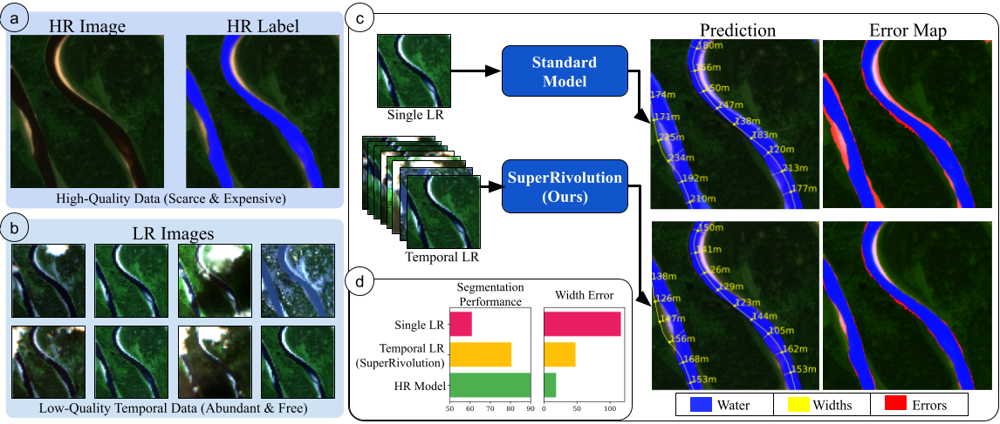

# SuperRivolution: Fine-Scale Rivers from Coarse Temporal Satellite Imagery
This repository contains the code for training and evaluating SuperRivolution models. We also provide the corresponding dataset that contains time series Sentinel data matched with high-resolution water segmentation labels.

## Overview
SuperRivolution leverages abundant low-resolution temporal data to improve performance on river segmentation. (a) High-resolution (HR) data are precise but scarce and expensive to acquire. (b) Low-resolution (LR) satellite imagery are freely available and abundant, although of lower quality. (c) A standard model using a single LR image produces predictions with significant errors (top row, errors in red). (d) By fusing information from multiple LR images, our proposed approach generates significantly more accurate segmentations and more reliable river width estimates, reducing prediction errors and closing the gap with HR models. 



## Environment Setup
1. Create a conda environment: `conda create -n superriv python=3.9`
2. Activate environment: `conda activate superriv`
3. Install all packages in the env with: `pip install -r requirements.txt`

## Run training on SuperRivolution
1. Download necessary checkpoints: [link](https://drive.google.com/drive/folders/1NNz4Qg2Ao62GUe_NAllv2BjSHYVJegf_?usp=drive_link). 
    - Place it in checkpoints such that it looks something like: superrivolution/checkpoints/moco_v3/*.pth
2. Download the [SuperRivolution data]()
3. Run training: `python 01_train.py --dist-url 'tcp://127.0.0.1:8001' --dist-backend 'nccl' --multiprocessing-distributed --world-size 1 --rank 0 --sr_type <sr-type> --data_dir <data path from prev step>`
    - `sr_type` can be one of: `model` (super-resolution),`input` (input upsampling),`output` (output upsampling)
    - You can additionally specify the segment_model, backbone, head, resize_size (resize_size depends on which model to use).  
    - To specify other parameters according to the table you can use the following arguments. We include options in the table below (each parameter corresponds to the first four columns in the table).
        - `--segment_model`
        - `--backbone`
        - `--head`
        - `--resize_size`
    - By default, training will use linear adapter, but this can be changed by specifying `--adaptor` to one of the following: `linear`, `no_init`, `drop`
    - The training will output 3 files: 1 log file, the latest checkpoint file, and the best checkpoint file (based on validation F1 score)
    - Results will be saved to `results/s2-water` by default (you can change it in `--out` parameter)
    - The file `01_script_train_s2_*.sh` can also be run as a batch job. `*` depends on the type of method to use (options: `input` for input upsampling, `output` for output upsampling, `sr_1im` for super-resolution using 1 image, `sr_8im` for super-resolution using 8 images). This script also contains the optimal learning rates for each of the model configurations.
<!-- 
If you do not wish to train your own model, you can also use pre-trained model checkpoints below. The corresponding optimal threshold based on the validation set is also included.
| segment_model| backbone               | head          | resize_size| checkpoint   | thresh | Description | 
| ---          | ---                    | ---           | ---        | ---           | ---           |---           |
| deeplabv3    | mobilenet_v2           | no_head       | 512 | [link]() | 0.3 | ImageNet1k pre-trained |
| deeplabv3    | resnet50               | no_head       | 512 | [link]() | 0.4 | ImageNet1k pre-trained |
| deeplabv3    | resnet50_mocov3        | no_head       | 512 | [link]() | 0.5 | MocoV3 pre-trained |
| deeplabv3    | resnet50_seco          | no_head       | 512 | [link]() | 0.2 | SeCo pre-trained |
| deeplabv3    | swinb                  | no_head       | 224 | [link]() | 0.5 | ImageNet1k pre-trained |
| deeplabv3    | swint                  | no_head       | 224 | [link]() | 0.5 | ImageNet1k pre-trained |
| dpt          | vitb                   | no_head       | 224 | [link]() | 0.2 | ImageNet1k pre-trained |
| dpt          | vitb_clip              | no_head       | 224 | [link]() | 0.3 | CLIP pre-trained  |
| dpt          | vitb_dino              | no_head       | 224 | [link]() | 0.4 | DINO pre-trained |
| dpt          | vitb_mocov3            | no_head       | 224 | [link]() | 0.1 | MocoV3 pre-trained |
| dpt          | vitl                   | no_head       | 224 | [link]() | 0.2 | ImageNet1k pre-trained |
| fpn          | mobilenet_v2           | no_head       | 512 | [link]() | 0.2 | ImageNet1k pre-trained |
| fpn          | resnet50               | no_head       | 512 | [link]() | 0.3 | ImageNet1k pre-trained |
| fpn          | resnet50_mocov3        | no_head       | 512 | [link]() | 0.3 | MocoV3 pre-trained |
| fpn          | resnet50_seco          | no_head       | 512 | [link]() | 0.3 | SeCo pre-trained |
| fpn          | satlas_si_resnet50     | satlas_head   | 512 | [link]() | 0.4 | SatlasPretrain pre-trained |
| fpn          | satlas_si_swinb        | satlas_head   | 512 | [link]() | 0.4 | SatlasPretrain pre-trained |
| fpn          | satlas_si_swint        | satlas_head   | 512 | [link]() | 0.3 | SatlasPretrain pre-trained |
| fpn          | swinb                  | no_head       | 224 | [link]() | 0.4 | ImageNet1k pre-trained |
| fpn          | swint                  | no_head       | 224 | [link]() | 0.4 | ImageNet1k pre-trained |
| unet         | mobilenet_v2           | no_head       | 512 | [link]() | 0.3 | ImageNet1k pre-trained |
| unet         | resnet50               | no_head       | 512 | [link]() | 0.2 | ImageNet1k pre-trained |
| unet         | resnet50_mocov3        | no_head       | 512 | [link]() | 0.4 | MocoV3 pre-trained |
| unet         | resnet50_seco          | no_head       | 512 | [link]() | 0.3 | SeCo pre-trained |
| unet         | swinb                  | no_head       | 224 | [link]() | 0.3 | ImageNet1k pre-trained |
| unet         | swint                  | no_head       | 224 | [link]() | 0.3 | ImageNet1k pre-trained | -->

## Run evaluation on SuperRivolution
### Water Segmentation
There are two options:
1. Run: `python 02_water_seg_eval.py --to_save_imgs 1 --ckpt_path <ckpt path> --to_ensemble <number of images to ensemble>`
    - This script will automatically find the best threshold using the RiverScope validation set
    - Alternatively, you can specify a threshold, e.g., `python 02_water_seg_eval.py --ckpt_path <ckpt path> --thresh 0.5`
    - This will save the metrics to the --out (default is results/s2-seg) with filename the same as the checkpoint name
    - Setting `--to_save_imgs 1` saves both the csv and the segmentation mask per image in the folder `results/s2-seg/<ckpt_name>`. Saving of the segmentation masks is needed for calculating the river width estimates.


### River Width Estimation
1. Run: `python 03_river_width_estimate.py --data_dir <data path of dataset> --raster_src "results/s2-seg-<method>/<ckpt_name>--<num_ensemble>" --is_gt 0 --raster_idx -1`
    - This will save results to specified --out (by default, it's results/predicted-widths). Inside the folder with the same name as the checkpoint
    - This will produce two sets of files per image: 1 csv file containing estimated width per node ("width_m" column is the estimated width in meters for the corresponding "node_id"), 1 png file to visualize estimated widths
2. Ground truth widths are available at 'SuperRivolution_dataset/PlanetScope/derived_gt_widths-test-wdate.csv' for a given node_id, reach_id, and date


## Performance
<!-- ### Water Segmentation
Included below are the results of training and evaluating multiple models with the same configurations (5 runs per model). The number inside the parenthesis is the standard deviation.
| Segmentation Model         | Backbone | Pre-training            | F1 Score       |Precision        | Recall      |
|----------------------------|----------|-------------------------|----------------|-----------------|----------------|
|DeepLabv3	|MV2	|Supervised (ImageNet1k)	|93.59 (0.27)	|94.40 (1.71)	|92.86 (2.10)	|
|DeepLabv3	|RN50	|Supervised (ImageNet1k)	|93.79 (0.40)	|92.58 (0.99)	|95.05 (0.93)	|
|DeepLabv3	|RN50	|MoCov3 (ImagetNet1k)	|93.92 (0.24)	|93.64 (0.47)	|94.20 (0.85)	|
|DeepLabv3	|RN50	|SeCo	|92.96 (1.13)	|92.49 (1.62)	|93.46 (2.02)	|
|DeepLabv3	|Swin-B	|Supervised (ImageNet1k)	|86.89 (0.40)	|86.53 (0.92)	|87.26 (0.87)	|
|DeepLabv3	|Swin-T	|Supervised (ImageNet1k)	|85.81 (1.11)	|85.23 (2.25)	|86.42 (0.77)	|
|DPT    	|ViT-B/16	|Supervised (ImageNet1k)	|91.21 (1.21)	|89.50 (1.65)	|92.99 (1.35)	|
|DPT    	|ViT-B/16	|CLIP	|93.30 (0.73)	|92.29 (1.22)	|94.36 (1.06)	|
|DPT    	|ViT-B/16	|DINO	|91.62 (1.20)	|89.18 (3.12)	|94.29 (1.50)	|
|DPT    	|ViT-B/16	|MoCov3 (ImagetNet1k)	|90.80 (0.83)	|88.43 (2.84)	|93.50 (4.15)	|
|DPT    	|ViT-L/16	|Supervised (ImageNet1k)	|92.88 (0.54)	|90.01 (0.27)	|95.94 (0.87)	|
|FPN	    |MV2	|Supervised (ImageNet1k)	|93.26 (0.69)	|91.38 (1.05)	|95.23 (0.91)	|
|FPN	    |RN50	|Supervised (ImageNet1k)	|93.64 (0.71)	|93.15 (0.83)	|94.14 (1.61)	|
|FPN	    |RN50	|MoCov3 (ImagetNet1k)	|93.39 (0.66)	|91.49 (3.23)	|95.50 (2.38)	|
|FPN	    |RN50	|SeCo	|93.55 (1.04)	|91.27 (3.12)	|96.03 (1.38)	|
|FPN	    |RN50	|SatlasNet	|93.41 (0.80)	|91.24 (2.09)	|95.72 (0.66)	|
|FPN	    |Swin-B	|SatlasNet	|93.60 (0.55)	|91.88 (0.73)	|95.40 (1.37)	|
|FPN	    |Swin-T	|SatlasNet	|94.35 (0.35)	|93.34 (0.49)	|95.39 (1.20)	|
|FPN	    |Swin-B	|Supervised (ImageNet1k)	|93.38 (0.72)	|91.61 (1.75)	|95.25 (0.78)	|
|FPN	    |Swin-T	|Supervised (ImageNet1k)	|93.27 (0.55)	|91.84 (1.44)	|94.75 (0.75)	|
|UNet	    |MV2	|Supervised (ImageNet1k)	|93.84 (1.08)	|91.80 (2.85)	|96.03 (1.40)	|
|UNet	    |RN50	|Supervised (ImageNet1k)	|94.05 (0.31)	|93.33 (1.17)	|94.80 (0.82)	|
|UNet	    |RN50	|MoCov3 (ImagetNet1k)	|94.20 (0.29)	|93.62 (0.43)	|94.80 (0.45)	|
|UNet   	|RN50	|SeCo	|94.39 (0.23)	|94.21 (1.39)	|94.62 (1.71)	|
|UNet   	|Swin-B	|Supervised (ImageNet1k)	|94.09 (0.63)	|93.01 (1.83)	|95.22 (0.66)	|
|UNet   	|Swin-T	|Supervised (ImageNet1k)	|93.30 (1.13)	|91.89 (3.12)	|94.84 (1.71)	|

### Width Estimation
The below show the median, mean, and standard deviation of the absolute errors in width estimation (in meters). These are the statistics across abount 400 nodes in the test set evaluation.

| Segmentation Model         | Backbone | Pre-training            | Median       | Mean        | Std Dev      |
|----------------------------|----------|-------------------------|----------------|-----------------|----------------|
|DeepLabv3	|MV2	|Supervised (ImageNet1k)	|12.00	|19.67	|30.77	|
|DeepLabv3	|RN50	|Supervised (ImageNet1k)	|9.00	|21.90	|75.03	|
|DeepLabv3	|RN50	|MoCov3 (ImagetNet1k)	|9.00	|15.76	|24.81	|
|DeepLabv3	|RN50	|SeCo	|12.00	|16.97	|21.96	|
|DeepLabv3	|Swin-B	|Supervised (ImageNet1k)	|40.50	|63.51	|101.64	|
|DeepLabv3	|Swin-T	|Supervised (ImageNet1k)	|34.71	|59.88	|101.13	|
|DPT	|ViT-B/16	|Supervised (ImageNet1k)	|19.50	|34.02	|75.51	|
|DPT	|ViT-B/16	|CLIP	|10.50	|23.13	|73.61	|
|DPT	|ViT-B/16	|DINO	|13.00	|22.81	|42.21	|
|DPT	|ViT-B/16	|MoCov3 (ImagetNet1k)	|22.50	|45.05	|94.93	|
|DPT	|ViT-L/16	|Supervised (ImageNet1k)	|16.25	|28.89	|49.54	|
|FPN	|MV2	|Supervised (ImageNet1k)	|11.33	|21.86	|41.51	|
|FPN	|RN50	|Supervised (ImageNet1k)	|7.20	|15.34	|26.48	|
|FPN	|RN50	|MoCov3 (ImagetNet1k)	|12.00	|20.12	|28.08	|
|FPN	|RN50	|SeCo	|8.62	|15.36	|25.80	|
|FPN	|RN50	|SatlasNet	|9.00	|21.79	|76.42	|
|FPN	|Swin-B	|SatlasNet	|11.49	|18.79	|29.01	|
|FPN	|Swin-T	|SatlasNet	|10.86	|18.12	|32.53	|
|FPN	|Swin-B	|Supervised (ImageNet1k)	|12.00	|18.20	|25.81	|
|FPN	|Swin-T	|Supervised (ImageNet1k)	|9.00	|18.48	|32.15	|
|UNet	|MV2	|Supervised (ImageNet1k)	|10.00	|21.78	|74.86	|
|UNet	|RN50	|Supervised (ImageNet1k)	|9.00	|19.00	|41.50	|
|UNet	|RN50	|MoCov3 (ImagetNet1k)	|8.45	|18.06	|37.50	|
|UNet	|RN50	|SeCo	|7.50	|16.26	|27.36	|
|UNet	|Swin-B	|Supervised (ImageNet1k)	|9.00	|16.32	|25.74	|
|UNet	|Swin-T	|Supervised (ImageNet1k)	|9.00	|17.56	|28.94	| -->


## Baselines
1. We refer to the [RiverScope repository](https://github.com/cvl-umass/riverscope-models) for running the training and evaluation of the RiverScope and Sentinel baselines

<!-- ## Citation
If you found this useful, please consider citing our work: -->
<!-- ```
@dataset{daroya_2025_15376394,
  author       = {Daroya, Rangel and
                  Maji, Subhransu},
  title        = {RiverScope: High-Resolution River Masking Dataset},
  month        = may,
  year         = 2025,
  publisher    = {Zenodo},
  doi          = {10.5281/zenodo.15376394},
  url          = {https://doi.org/10.5281/zenodo.15376394},
}
``` -->